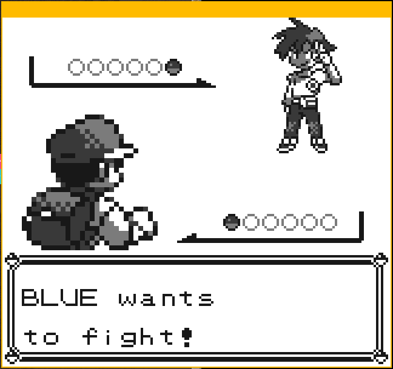
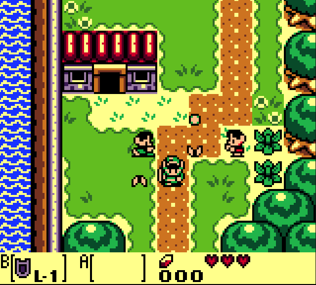
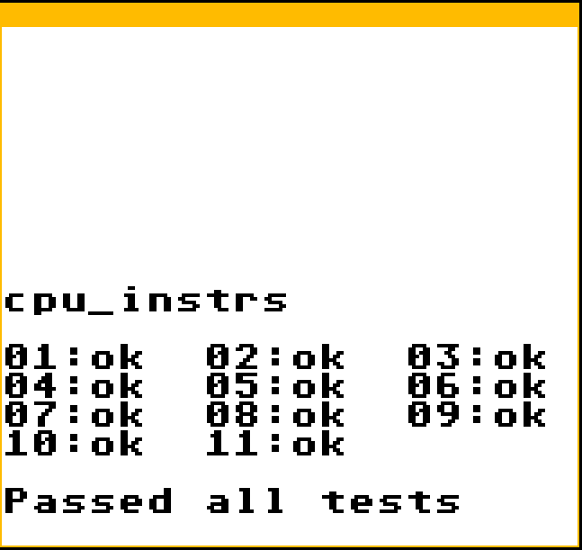

# JumperBoy-emulator

GameBoy Emulator using SDL2 for rendering and audio, and Imgui for the user interface. 
Works on both linux and windows.

*Fight against the rival in Pokemon Red*

*Exploring in Link's awakening*

## Compilation

### Linux

For a basic compilation, simply compile this like a regular cmake project:

$ cmake -B build  
$ make -C build  

You can also use the cmake tools in VScode to build other configurations.

### Windows

To properly compile this application on windows, you must first give it access to the SDL2.dll in the libs/SDL2 folder.
To do this, add a new path to the PATH environnement variable that points to the .dll file in this project. Optionnaly, you 
can simply move the .dll file in the folder containing the .exe after compiling.  

For the audio to work, you might need to set the SDL_AUDIODRIVER environnement variable to a sensible value like directsound.  

To compile this application, simply compile it like a cmake project in microsoft visual studio 2022. For now, only the x64 versions 
are working.

## Tests

Passes all the basic Blargg test for instructions and the acid2 tests by Math Currie.

*Blargg cpu_instrs.gb test ROM result*

The Mooneye tests for MBC1 and MBC5 ROM data also passes.

## Games

Most GB games should work fine if the proper cartridge hardware is supported. However, most CGB games won't be functional

### Known Issues

- Pokemon Silver/Gold: Restarts the game when doing random actions 
- Pokemon Crystal: Doesn't close the menu properly and triggers the "no window available for popping" debugging message
